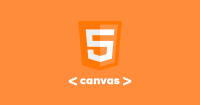

### Juego basico con 
## CANVA Html y JS

**Funcionamiento**
- El jugador 1 se mueve con las teclas de A,W,D y ataca con la barra de espacio
- El jugador 2 se mueve con las flechas de dirección y ataca con la flecha de abajo

----------------------------------------------------------------
